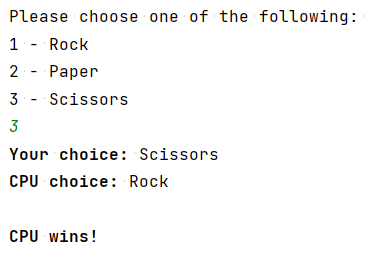
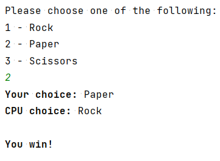

# Rock-Paper-Scissors

A simple **Rock-Paper-Scissors** game in Java, coded for learning purposes. The player chooses from all three options (namely, "rock", "paper" or "scissors") from corresponding numbers and the CPU makes its choice from a random number generator.

**TO DO:** Implement small "quality of life" features such as automatic resets.
